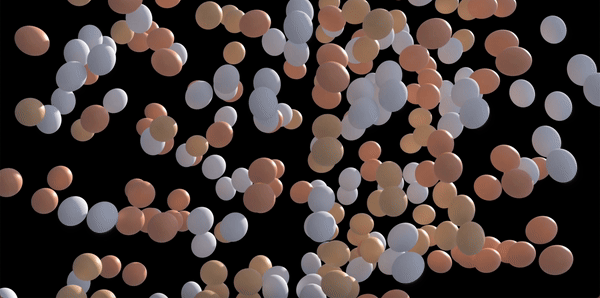

# 3D Egg Drop Simulator 🥚🥚🐣

Ever since I had to do the egg drop test in middle school, I've always wondered, "Do we *really* need to drop a bunch of eggs off the roof of a building to teach kids physics? *In this economy?*" 

With this web-based 3D egg drop simulator, parents and educators can effortlessly prepare for physics lessons, sparing both these questions and a carton of eggs.



# How to Install & Use

1. `clone` repository and `cd` into directory.
2. If you don't already have it, install Node.js.
3. Run:
```bash
npm install
```
4. Then compile scripts and start server by running the following:
```bash
npm start
```
5. Navigate to `http://localhost:3000`. 

